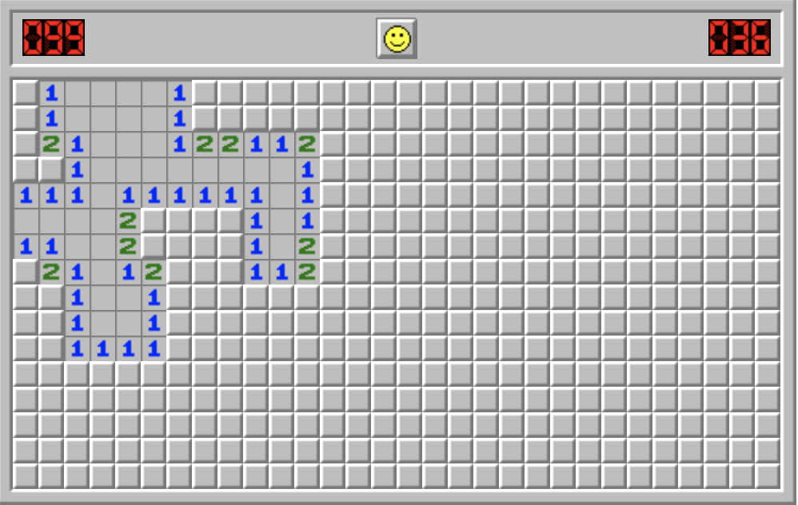

## Minesweeper
Run: minesweeper.html

---

### What is Minesweeper?

---

http://minesweeperonline.com/

---

- Game goal is to find/mark all Mines
- When a square is clicked reveal if its a mine or reveal all bordering squares with the number adjacent mines
- When a square not bordering a mine is clicked reveal all bordering empty and bordering mine squares
- Let users mark which squares they think has a mine

---

### Additional Features:

- Double-Click to reveal surrounding tiles, if there are a correct number of surrounding flags
  - Can Double-Click on a "2" if there are two flags surrounding it
- Click on Smiley face to restart the game
- Difficulty Selection, with Custom Map Size
- First click is never a Mine
